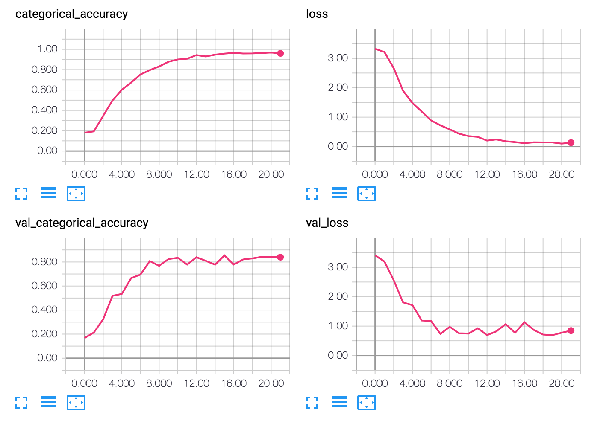

# [Birdwatcher](https://www.youtube.com/watch?v=e4mC3dmwqEY)

Bird identification deep neural network using SqueezeNet architecture with simple bypass connections.

## Data

The data used in this model is scraped from various sources. I'll have to check the lisencing of every file 
before releasing the model or the actual scraped data.

### Preprocessing

The data is used as is, meaning no noise reduction of other filtering is
applied. Only some of the silent sections of the files are removed before
cutting the pieces into 3sec mono audio files.

The splitting is applied with a sliding window of 1.5sec steps.
This way more audio samples are generated from each audio file.

The files are then written to a `TFRecord`-file. This way we minimize
A number of readable files and minimize the amount of IO operations.

After this, the samples are ready for use.

### Feeding data to the network

the 3sec files are then fed through a Short Time Fourier Transform (STFT)
to generate a spectral representation of the audio, that is suitable for
the SqueezeNet.

The data is read by a `TFRecordDataset` iterator from the `TFRecord`-file.
This allows nice API for multithreaded preloading and transformation of
the audio files. The code can be found in
[`generators.py`](birdwatcher/generators.py)

At first, the network had own STFT-implementation, but due to the freezing
and inference optimization, the preloading graph could not be used after
the optimization. This is why the project now uses
[kapre](https://github.com/keunwoochoi/kapre).

### The network

The network implementation can be found in [`main.py`](main.py).
It's a basic SqueezeNet that takes in the 3sec audio files and transforms
the files with STFT and injects some additive noise during training (so
that the train examples vary a little always between even epochs).

## Results

The current model has been trained for around 20 epochs with
Train accuracy of ~0.96 and test accuracy of ~0.84. This is not perfect
but it's a start for a quite simple architecture.

## Future

I'll try to improve this network at some point. But before optimizing that
my priority is to bundle this into an iPhone-app.

# Running
You would need a bunch of data first but, yeah:

`virtualenv -p python3 env`
`source env/bin/activate`
`pip install -r requirements.txt`

## Write `TFRecord`-files

`python lib/tfrecord_writer.py`

## Train
`python main.py`

## Optimize
`python keras_to_tf.py`
